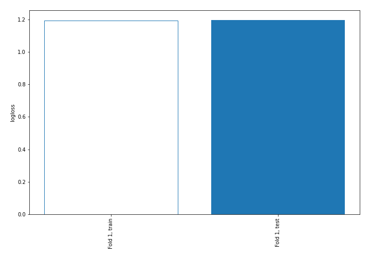
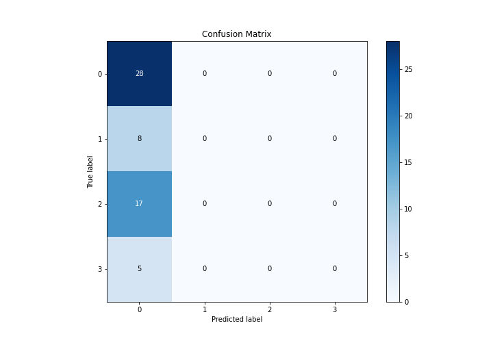
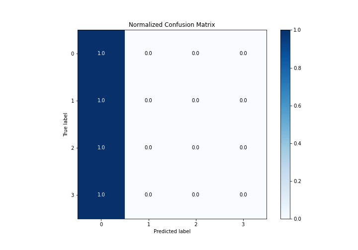
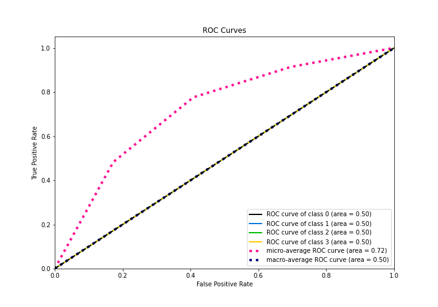
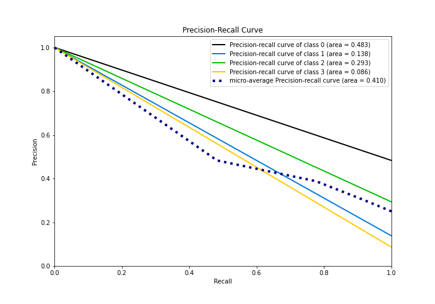

# Summary of 1_Baseline

[<< Go back](../README.md)

## Baseline Classifier (Baseline)
- **n_jobs**: -1
- **num_class**: 4
- **explain_level**: 2

## Validation
 - **validation_type**: split
 - **train_ratio**: 0.75
 - **shuffle**: True
 - **stratify**: True

## Optimized metric
logloss

## Training time

0.4 seconds

### Metric details
|           |         0 |   1 |   2 |   3 |   accuracy |   macro avg |   weighted avg |   logloss |
|:----------|----------:|----:|----:|----:|-----------:|------------:|---------------:|----------:|
| precision |  0.482759 |   0 |   0 |   0 |   0.482759 |    0.12069  |       0.233056 |   1.19587 |
| recall    |  1        |   0 |   0 |   0 |   0.482759 |    0.25     |       0.482759 |   1.19587 |
| f1-score  |  0.651163 |   0 |   0 |   0 |   0.482759 |    0.162791 |       0.314354 |   1.19587 |
| support   | 28        |   8 |  17 |   5 |   0.482759 |   58        |      58        |   1.19587 |

## Confusion matrix
|              |   Predicted as 0 |   Predicted as 1 |   Predicted as 2 |   Predicted as 3 |
|:-------------|-----------------:|-----------------:|-----------------:|-----------------:|
| Labeled as 0 |               28 |                0 |                0 |                0 |
| Labeled as 1 |                8 |                0 |                0 |                0 |
| Labeled as 2 |               17 |                0 |                0 |                0 |
| Labeled as 3 |                5 |                0 |                0 |                0 |

## Learning curves

## Confusion Matrix

## Normalized Confusion Matrix

## ROC Curve

## Precision Recall Curve

[<< Go back](../README.md)
