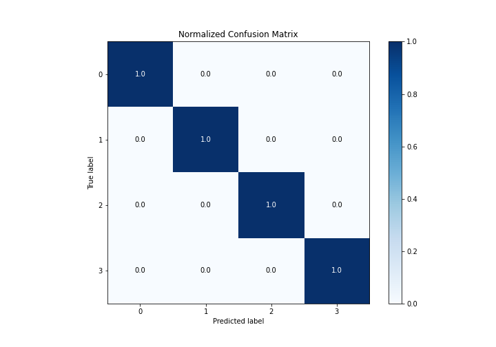
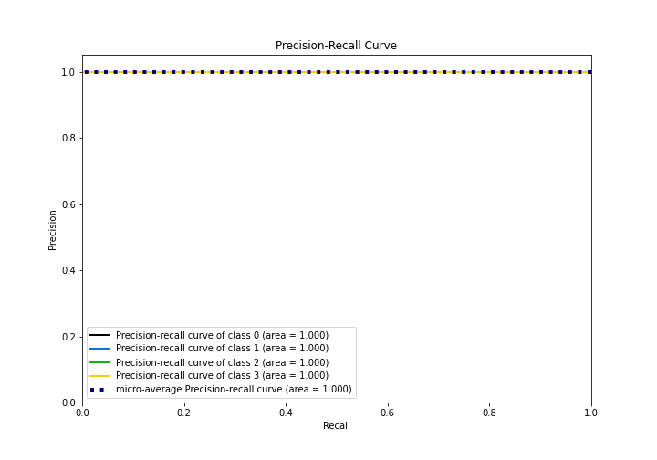
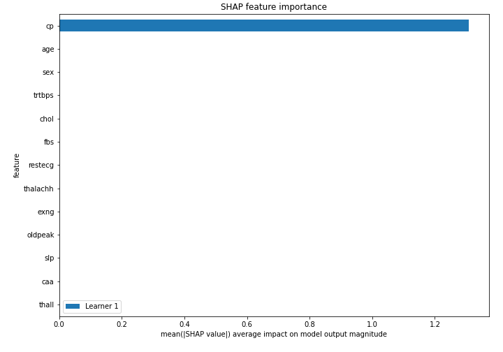
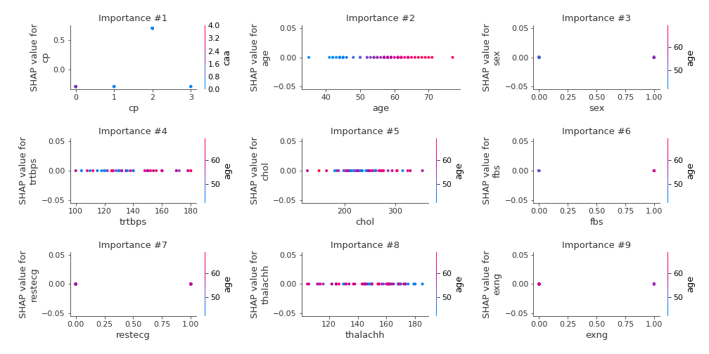
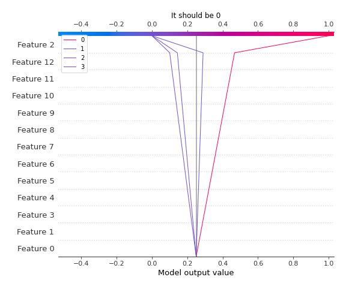
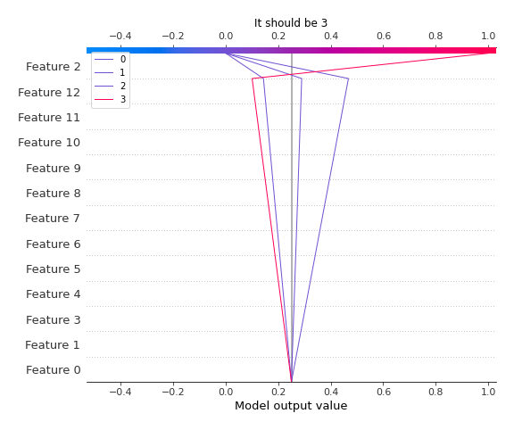

# Summary of 2_DecisionTree

[<< Go back](../README.md)

## Decision Tree
- **n_jobs**: -1
- **criterion**: gini
- **max_depth**: 3
- **num_class**: 4
- **explain_level**: 2

## Validation
 - **validation_type**: split
 - **train_ratio**: 0.75
 - **shuffle**: True
 - **stratify**: True

## Optimized metric
logloss

## Training time

23.7 seconds

### Metric details
|           |   0 |   1 |   2 |   3 |   accuracy |   macro avg |   weighted avg |   logloss |
|:----------|----:|----:|----:|----:|-----------:|------------:|---------------:|----------:|
| precision |   1 |   1 |   1 |   1 |          1 |           1 |              1 |     3e-06 |
| recall    |   1 |   1 |   1 |   1 |          1 |           1 |              1 |     3e-06 |
| f1-score  |   1 |   1 |   1 |   1 |          1 |           1 |              1 |     3e-06 |
| support   |  28 |   8 |  17 |   5 |          1 |          58 |             58 |     3e-06 |

## Confusion matrix
|              |   Predicted as 0 |   Predicted as 1 |   Predicted as 2 |   Predicted as 3 |
|:-------------|-----------------:|-----------------:|-----------------:|-----------------:|
| Labeled as 0 |               28 |                0 |                0 |                0 |
| Labeled as 1 |                0 |                8 |                0 |                0 |
| Labeled as 2 |                0 |                0 |               17 |                0 |
| Labeled as 3 |                0 |                0 |                0 |                5 |

## Learning curves

## Decision Tree 

### Tree #1

### Rules

if (cp <= 0.5) then class: 0 (proba: 100.0%) | based on 83 samples

if (cp > 0.5) and (cp > 1.5) and (cp <= 2.5) then class: 2 (proba: 100.0%) | based on 50 samples

if (cp > 0.5) and (cp <= 1.5) then class: 1 (proba: 100.0%) | based on 23 samples

if (cp > 0.5) and (cp > 1.5) and (cp > 2.5) then class: 3 (proba: 100.0%) | based on 15 samples

## Permutation-based Importance

## Confusion Matrix

## Normalized Confusion Matrix

## ROC Curve

## Precision Recall Curve

## SHAP Importance

## SHAP Dependence plots

### Dependence 0 (Fold 1)

### Dependence 1 (Fold 1)

### Dependence 2 (Fold 1)

### Dependence 3 (Fold 1)

## SHAP Decision plots

### Worst decisions for selected sample 1 (Fold 1)

### Worst decisions for selected sample 2 (Fold 1)

### Worst decisions for selected sample 3 (Fold 1)

### Worst decisions for selected sample 4 (Fold 1)

### Best decisions for selected sample 1 (Fold 1)

### Best decisions for selected sample 2 (Fold 1)

### Best decisions for selected sample 3 (Fold 1)

### Best decisions for selected sample 4 (Fold 1)

[<< Go back](../README.md)
