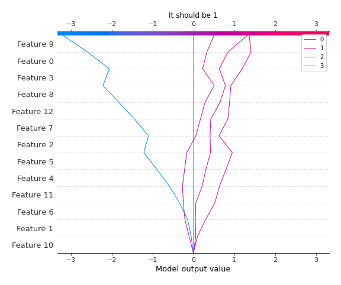
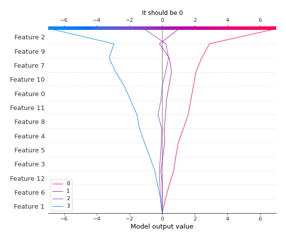

# Summary of 3_Linear

[<< Go back](../README.md)

## Logistic Regression (Linear)
- **n_jobs**: -1
- **num_class**: 4
- **explain_level**: 2

## Validation
 - **validation_type**: split
 - **train_ratio**: 0.75
 - **shuffle**: True
 - **stratify**: True

## Optimized metric
logloss

## Training time

9.3 seconds

### Metric details
|           |         0 |        1 |         2 |        3 |   accuracy |   macro avg |   weighted avg |   logloss |
|:----------|----------:|---------:|----------:|---------:|-----------:|------------:|---------------:|----------:|
| precision |  0.965517 | 1        |  0.866667 | 0.5      |    0.87931 |    0.833046 |       0.901169 |  0.324275 |
| recall    |  1        | 0.75     |  0.764706 | 0.8      |    0.87931 |    0.828676 |       0.87931  |  0.324275 |
| f1-score  |  0.982456 | 0.857143 |  0.8125   | 0.615385 |    0.87931 |    0.816871 |       0.883713 |  0.324275 |
| support   | 28        | 8        | 17        | 5        |    0.87931 |   58        |      58        |  0.324275 |

## Confusion matrix
|              |   Predicted as 0 |   Predicted as 1 |   Predicted as 2 |   Predicted as 3 |
|:-------------|-----------------:|-----------------:|-----------------:|-----------------:|
| Labeled as 0 |               28 |                0 |                0 |                0 |
| Labeled as 1 |                1 |                6 |                1 |                0 |
| Labeled as 2 |                0 |                0 |               13 |                4 |
| Labeled as 3 |                0 |                0 |                1 |                4 |

## Learning curves

## Coefficients

### Coefficients learner #1
|           |          0 |          1 |          2 |           3 |
|:----------|-----------:|-----------:|-----------:|------------:|
| intercept |  1.27427   |  1.32928   |  1.04629   | -3.64984    |
| age       |  0.0505084 |  0.0529313 |  0.0246103 | -0.12805    |
| sex       |  0.096063  | -0.168358  | -0.220647  |  0.292942   |
| cp        | -4.39262   | -1.20239   |  1.57084   |  4.02416    |
| trtbps    |  0.0977624 | -0.175974  | -0.227614  |  0.305826   |
| chol      | -0.22106   |  0.167807  |  0.0451508 |  0.00810228 |
| fbs       | -0.189638  |  0.016803  |  0.038884  |  0.133951   |
| restecg   | -0.0840534 |  0.0890863 |  0.0826538 | -0.0876867  |
| thalachh  | -0.286746  |  0.328199  | -0.169837  |  0.128384   |
| exng      |  0.263904  | -0.0465118 | -0.443717  |  0.226325   |
| oldpeak   |  0.236003  | -0.487923  | -0.154031  |  0.40595    |
| slp       | -0.034941  | -0.0631172 | -0.184935  |  0.282994   |
| caa       |  0.0185166 | -0.0531825 |  0.10331   | -0.0686437  |
| thall     |  0.142689  | -0.188132  | -0.0880846 |  0.133527   |

## Permutation-based Importance

## Confusion Matrix

## Normalized Confusion Matrix

## ROC Curve

## Precision Recall Curve

## SHAP Importance

## SHAP Dependence plots

### Dependence 0 (Fold 1)

### Dependence 1 (Fold 1)

### Dependence 2 (Fold 1)

### Dependence 3 (Fold 1)

## SHAP Decision plots

### Worst decisions for selected sample 1 (Fold 1)

### Worst decisions for selected sample 2 (Fold 1)

### Worst decisions for selected sample 3 (Fold 1)

### Worst decisions for selected sample 4 (Fold 1)

### Best decisions for selected sample 1 (Fold 1)

### Best decisions for selected sample 2 (Fold 1)

### Best decisions for selected sample 3 (Fold 1)

### Best decisions for selected sample 4 (Fold 1)

[<< Go back](../README.md)
