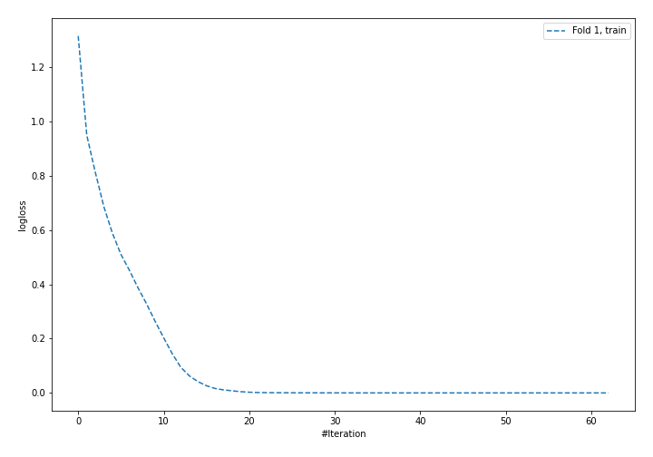
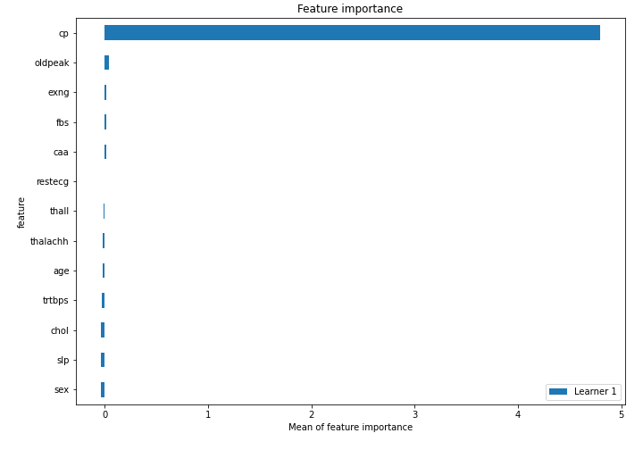
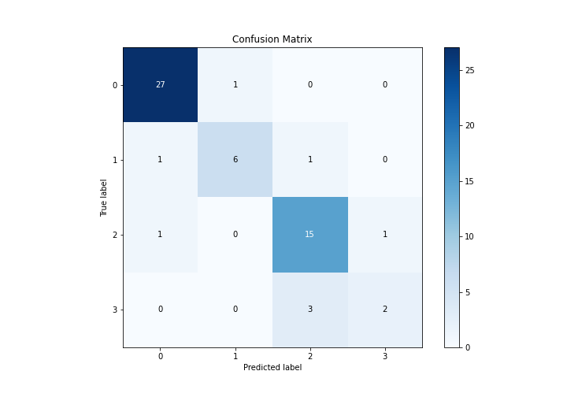
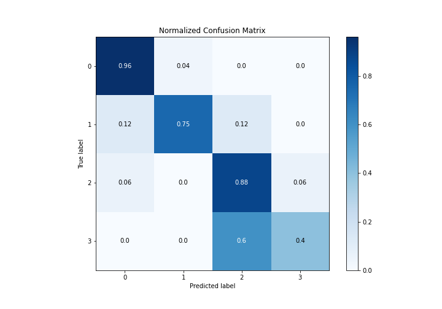
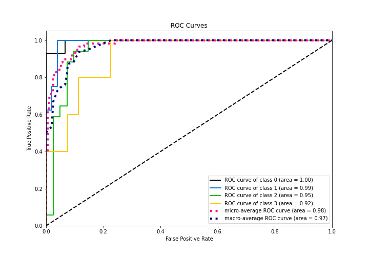
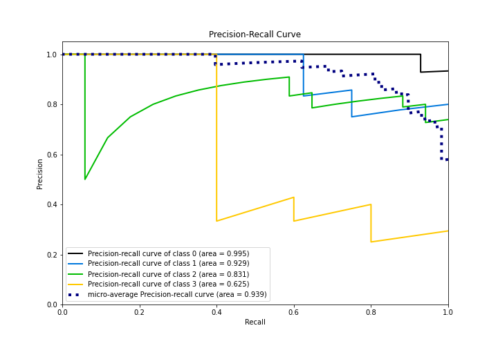

# Summary of 5_Default_NeuralNetwork

[<< Go back](../README.md)

## Neural Network
- **n_jobs**: -1
- **dense_1_size**: 32
- **dense_2_size**: 16
- **learning_rate**: 0.05
- **num_class**: 4
- **explain_level**: 2

## Validation
 - **validation_type**: split
 - **train_ratio**: 0.75
 - **shuffle**: True
 - **stratify**: True

## Optimized metric
logloss

## Training time

1.1 seconds

### Metric details
|           |         0 |        1 |         2 |        3 |   accuracy |   macro avg |   weighted avg |   logloss |
|:----------|----------:|---------:|----------:|---------:|-----------:|------------:|---------------:|----------:|
| precision |  0.931034 | 0.857143 |  0.789474 | 0.666667 |   0.862069 |    0.811079 |       0.85656  |  0.343986 |
| recall    |  0.964286 | 0.75     |  0.882353 | 0.4      |   0.862069 |    0.74916  |       0.862069 |  0.343986 |
| f1-score  |  0.947368 | 0.8      |  0.833333 | 0.5      |   0.862069 |    0.770175 |       0.855051 |  0.343986 |
| support   | 28        | 8        | 17        | 5        |   0.862069 |   58        |      58        |  0.343986 |

## Confusion matrix
|              |   Predicted as 0 |   Predicted as 1 |   Predicted as 2 |   Predicted as 3 |
|:-------------|-----------------:|-----------------:|-----------------:|-----------------:|
| Labeled as 0 |               27 |                1 |                0 |                0 |
| Labeled as 1 |                1 |                6 |                1 |                0 |
| Labeled as 2 |                1 |                0 |               15 |                1 |
| Labeled as 3 |                0 |                0 |                3 |                2 |

## Learning curves

## Permutation-based Importance

## Confusion Matrix

## Normalized Confusion Matrix

## ROC Curve

## Precision Recall Curve

[<< Go back](../README.md)
