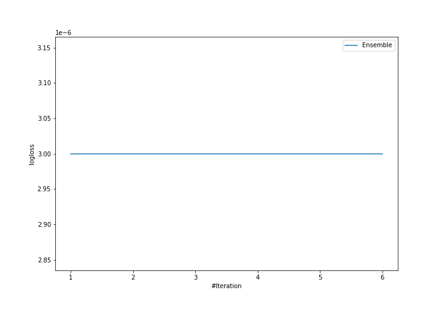
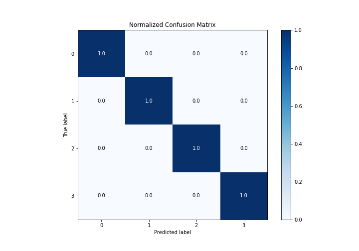
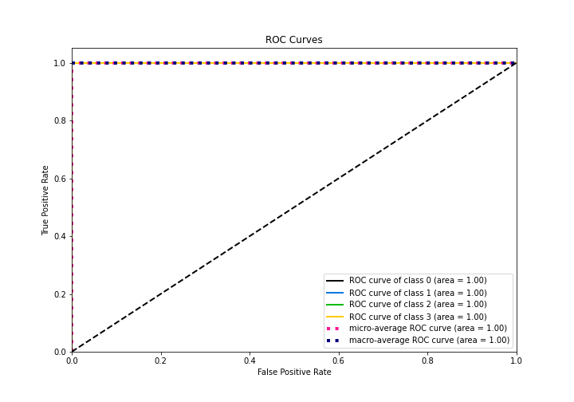

# Summary of Ensemble

[<< Go back](../README.md)

## Ensemble structure
| Model          |   Weight |
|:---------------|---------:|
| 2_DecisionTree |        1 |

### Metric details
|           |   0 |   1 |   2 |   3 |   accuracy |   macro avg |   weighted avg |   logloss |
|:----------|----:|----:|----:|----:|-----------:|------------:|---------------:|----------:|
| precision |   1 |   1 |   1 |   1 |          1 |           1 |              1 |     3e-06 |
| recall    |   1 |   1 |   1 |   1 |          1 |           1 |              1 |     3e-06 |
| f1-score  |   1 |   1 |   1 |   1 |          1 |           1 |              1 |     3e-06 |
| support   |  28 |   8 |  17 |   5 |          1 |          58 |             58 |     3e-06 |

## Confusion matrix
|              |   Predicted as 0 |   Predicted as 1 |   Predicted as 2 |   Predicted as 3 |
|:-------------|-----------------:|-----------------:|-----------------:|-----------------:|
| Labeled as 0 |               28 |                0 |                0 |                0 |
| Labeled as 1 |                0 |                8 |                0 |                0 |
| Labeled as 2 |                0 |                0 |               17 |                0 |
| Labeled as 3 |                0 |                0 |                0 |                5 |

## Learning curves

## Confusion Matrix

## Normalized Confusion Matrix

## ROC Curve

## Precision Recall Curve

[<< Go back](../README.md)
