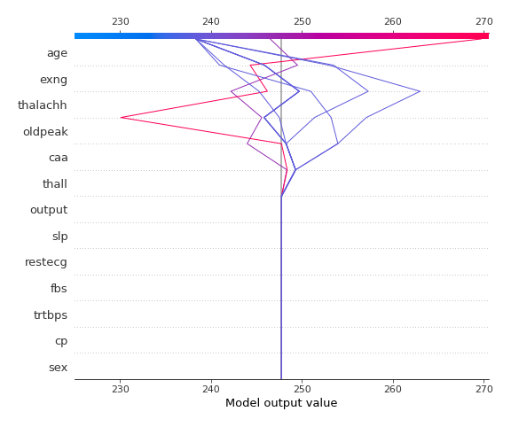

# Summary of 2_DecisionTree

[<< Go back](../README.md)

## Decision Tree
- **n_jobs**: -1
- **criterion**: mse
- **max_depth**: 3
- **explain_level**: 2

## Validation
 - **validation_type**: split
 - **train_ratio**: 0.75
 - **shuffle**: True

## Optimized metric
rmse

## Training time

4.5 seconds

### Metric details:
| Metric   |       Score |
|:---------|------------:|
| MAE      |   38.0484   |
| MSE      | 2175.88     |
| RMSE     |   46.6463   |
| R2       |   -0.358866 |
| MAPE     |    0.162539 |

## Learning curves

## Decision Tree 

### Tree #1

### Rules

if (age <= 61.5) and (exng <= 0.5) and (thall > 1.5) then response: 238.33 | based on 109 samples

if (age <= 61.5) and (exng > 0.5) and (caa <= 1.5) then response: 246.51 | based on 49 samples

if (age > 61.5) and (thalachh <= 150.5) and (oldpeak <= 3.45) then response: 245.774 | based on 31 samples

if (age <= 61.5) and (exng > 0.5) and (caa > 1.5) then response: 285.727 | based on 11 samples

if (age > 61.5) and (thalachh > 150.5) and (oldpeak <= 0.7) then response: 269.7 | based on 10 samples

if (age > 61.5) and (thalachh > 150.5) and (oldpeak > 0.7) then response: 353.778 | based on 9 samples

if (age <= 61.5) and (exng <= 0.5) and (thall <= 1.5) then response: 198.5 | based on 6 samples

if (age > 61.5) and (thalachh <= 150.5) and (oldpeak > 3.45) then response: 175.5 | based on 2 samples

## Permutation-based Importance

## True vs Predicted

## Predicted vs Residuals

## SHAP Importance

## SHAP Dependence plots

### Dependence (Fold 1)

## SHAP Decision plots

### Top-10 Worst decisions (Fold 1)

### Top-10 Best decisions (Fold 1)

[<< Go back](../README.md)
