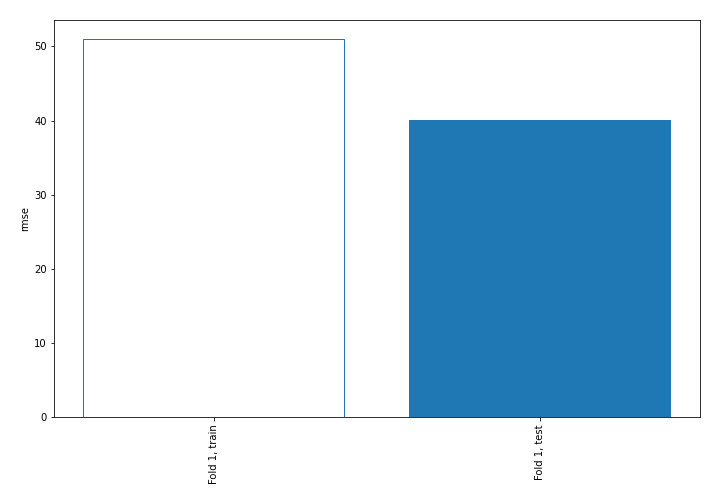
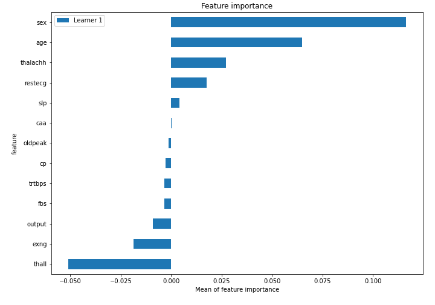
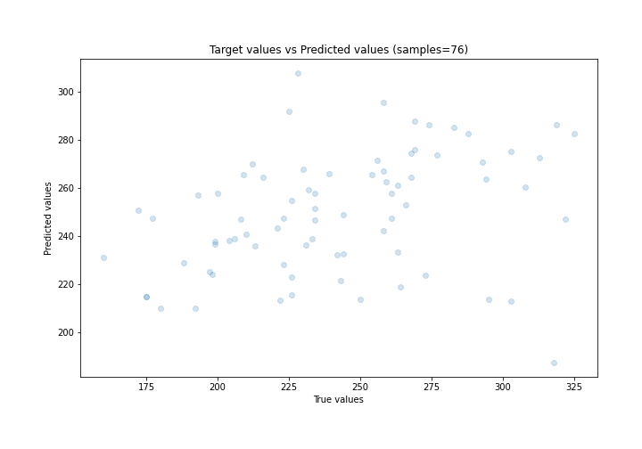
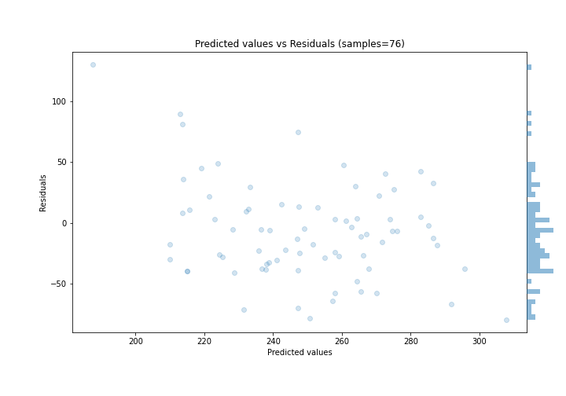
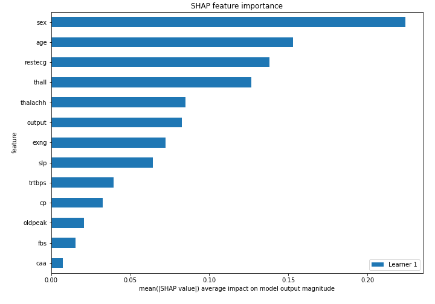
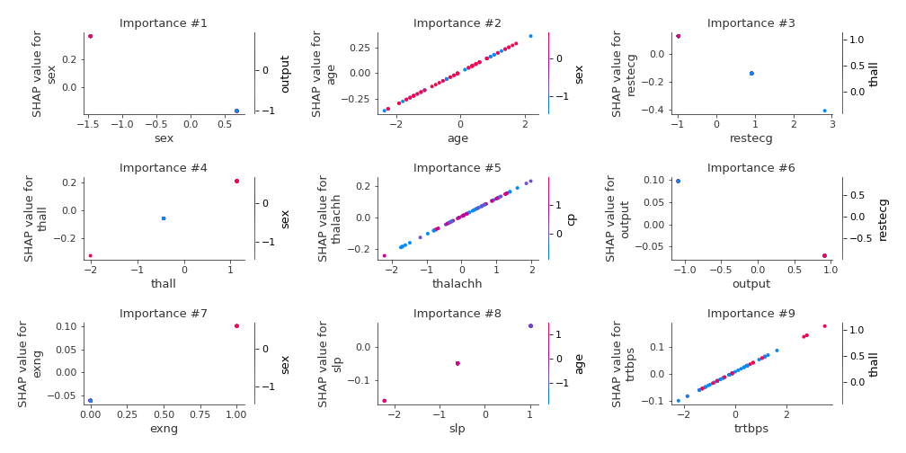
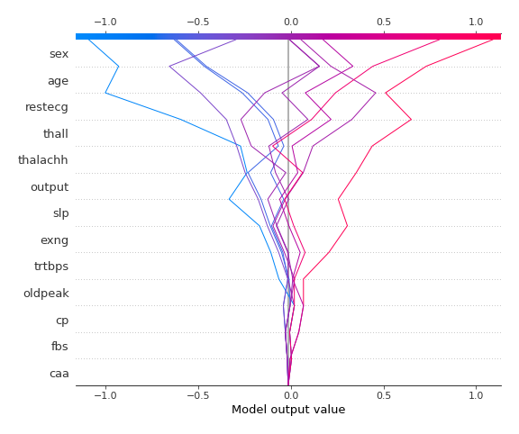
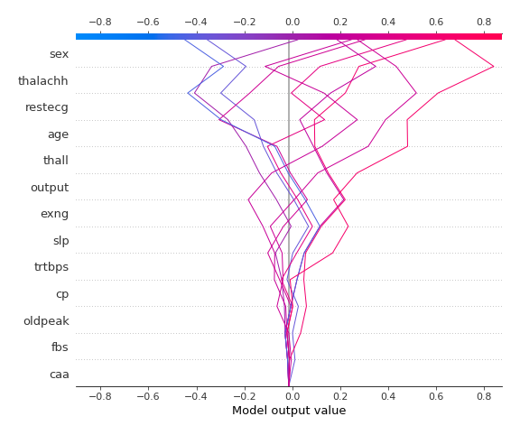

# Summary of 3_Linear

[<< Go back](../README.md)

## Linear Regression (Linear)
- **n_jobs**: -1
- **explain_level**: 2

## Validation
 - **validation_type**: split
 - **train_ratio**: 0.75
 - **shuffle**: True

## Optimized metric
rmse

## Training time

3.1 seconds

### Metric details:
| Metric   |         Score |
|:---------|--------------:|
| MAE      |   31.3677     |
| MSE      | 1607.53       |
| RMSE     |   40.094      |
| R2       |   -0.00392512 |
| MAPE     |    0.136148   |

## Learning curves

## Coefficients
| feature   |   Learner_1 |
|:----------|------------:|
| thall     |  0.169459   |
| age       |  0.162651   |
| exng      |  0.161141   |
| thalachh  |  0.114071   |
| slp       |  0.0711428  |
| fbs       |  0.0570083  |
| trtbps    |  0.048487   |
| caa       |  0.00736213 |
| oldpeak   | -0.0292982  |
| cp        | -0.0378626  |
| intercept | -0.0631988  |
| output    | -0.0838482  |
| restecg   | -0.140859   |
| sex       | -0.242367   |

## Permutation-based Importance

## True vs Predicted

## Predicted vs Residuals

## SHAP Importance

## SHAP Dependence plots

### Dependence (Fold 1)

## SHAP Decision plots

### Top-10 Worst decisions (Fold 1)

### Top-10 Best decisions (Fold 1)

[<< Go back](../README.md)
