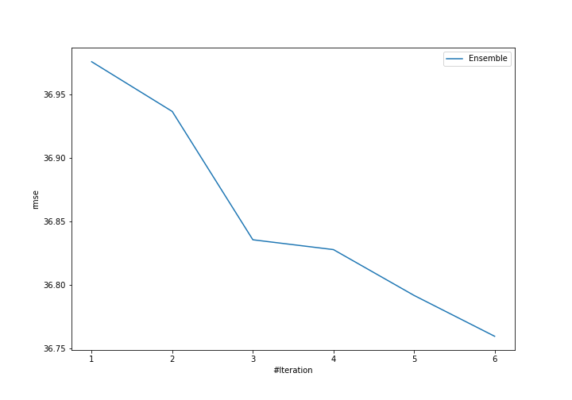
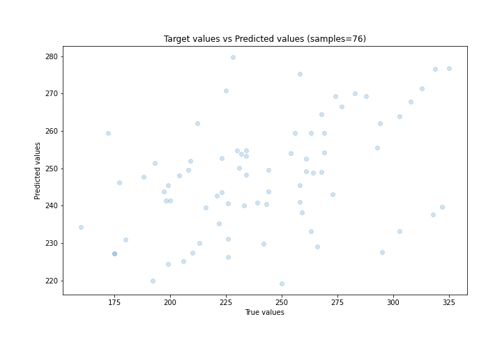
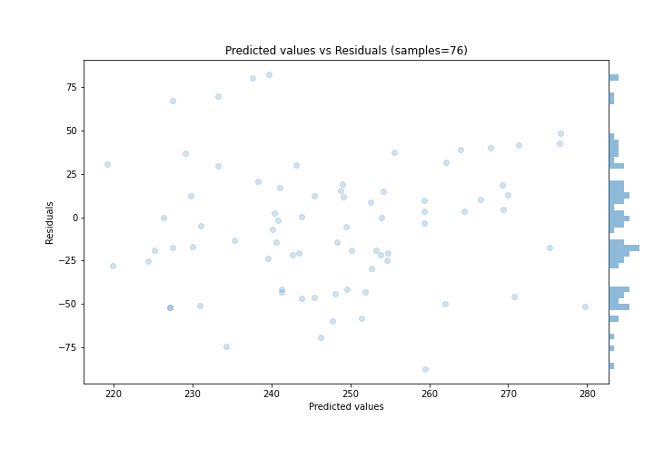

# Summary of Ensemble

[<< Go back](../README.md)

## Ensemble structure
| Model                   |   Weight |
|:------------------------|---------:|
| 3_Linear                |        1 |
| 5_Default_NeuralNetwork |        4 |
| 6_Default_RandomForest  |        1 |

### Metric details:
| Metric   |       Score |
|:---------|------------:|
| MAE      |   29.6805   |
| MSE      | 1351.29     |
| RMSE     |   36.7598   |
| R2       |    0.156103 |
| MAPE     |    0.130562 |

## Learning curves

## True vs Predicted

## Predicted vs Residuals

[<< Go back](../README.md)
