# Summary of 2_DecisionTree

[<< Go back](../README.md)

## Decision Tree
- **n_jobs**: -1
- **criterion**: gini
- **max_depth**: 3
- **num_class**: 4
- **explain_level**: 2

## Validation
 - **validation_type**: split
 - **train_ratio**: 0.75
 - **shuffle**: True
 - **stratify**: True

## Optimized metric
logloss

## Training time

11.4 seconds

### Metric details
|           |         0 |     1 |         2 |   3 |   accuracy |   macro avg |   weighted avg |   logloss |
|:----------|----------:|------:|----------:|----:|-----------:|------------:|---------------:|----------:|
| precision |  0.625    |  0.2  |  0.5      | 0.4 |   0.465517 |    0.43125  |       0.497845 |   2.15369 |
| recall    |  0.555556 |  0.3  |  0.4375   | 0.4 |   0.465517 |    0.423264 |       0.465517 |   2.15369 |
| f1-score  |  0.588235 |  0.24 |  0.466667 | 0.4 |   0.465517 |    0.423725 |       0.478431 |   2.15369 |
| support   | 27        | 10    | 16        | 5   |   0.465517 |   58        |      58        |   2.15369 |

## Confusion matrix
|              |   Predicted as 0 |   Predicted as 1 |   Predicted as 2 |   Predicted as 3 |
|:-------------|-----------------:|-----------------:|-----------------:|-----------------:|
| Labeled as 0 |               15 |                6 |                3 |                3 |
| Labeled as 1 |                5 |                3 |                2 |                0 |
| Labeled as 2 |                3 |                6 |                7 |                0 |
| Labeled as 3 |                1 |                0 |                2 |                2 |

## Learning curves
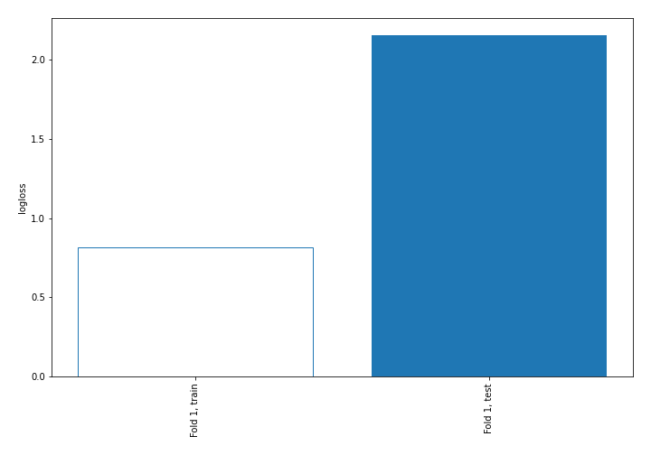

## Decision Tree 

### Tree #1
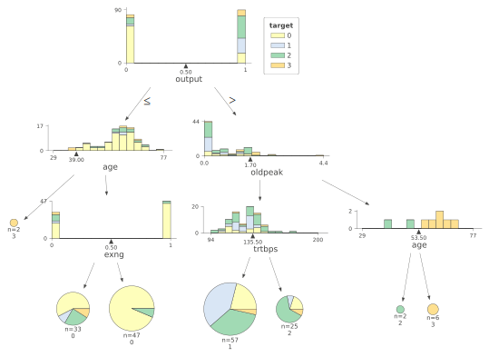

### Rules

if (output > 0.5) and (oldpeak <= 1.7) and (trtbps <= 135.5) then class: 1 (proba: 40.35%) | based on 57 samples

if (output <= 0.5) and (age > 39.0) and (exng > 0.5) then class: 0 (proba: 93.62%) | based on 47 samples

if (output <= 0.5) and (age > 39.0) and (exng <= 0.5) then class: 0 (proba: 57.58%) | based on 33 samples

if (output > 0.5) and (oldpeak <= 1.7) and (trtbps > 135.5) then class: 2 (proba: 64.0%) | based on 25 samples

if (output > 0.5) and (oldpeak > 1.7) and (age > 53.5) then class: 3 (proba: 100.0%) | based on 6 samples

if (output > 0.5) and (oldpeak > 1.7) and (age <= 53.5) then class: 2 (proba: 100.0%) | based on 2 samples

if (output <= 0.5) and (age <= 39.0) then class: 3 (proba: 100.0%) | based on 2 samples

## Permutation-based Importance
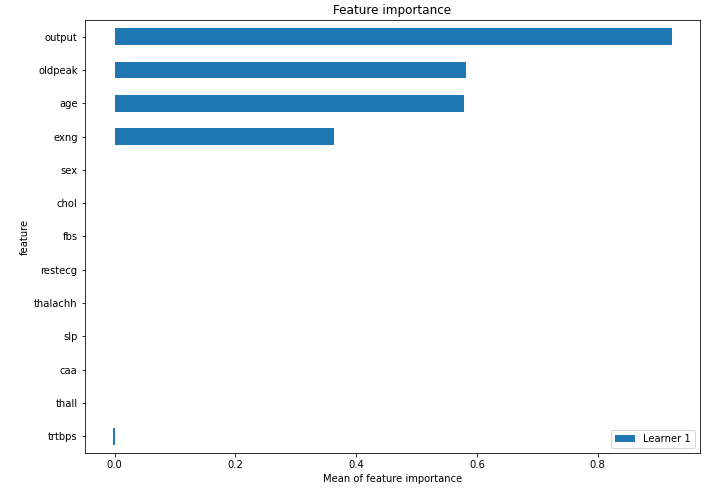
## Confusion Matrix

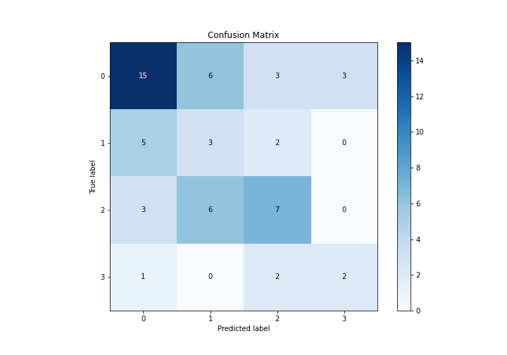

## Normalized Confusion Matrix

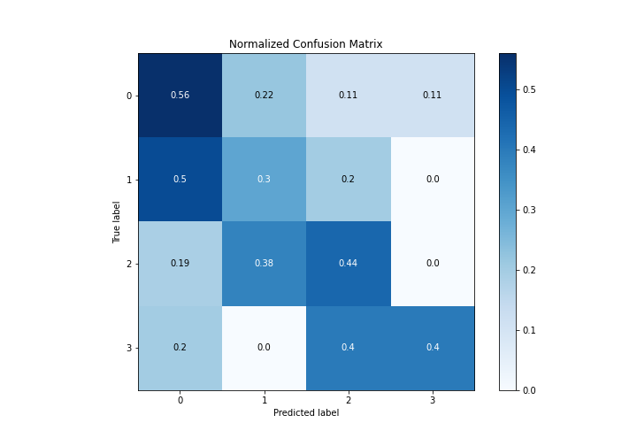

## ROC Curve

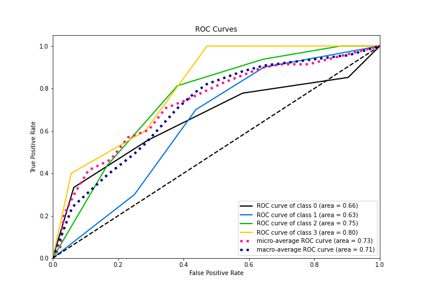

## Precision Recall Curve

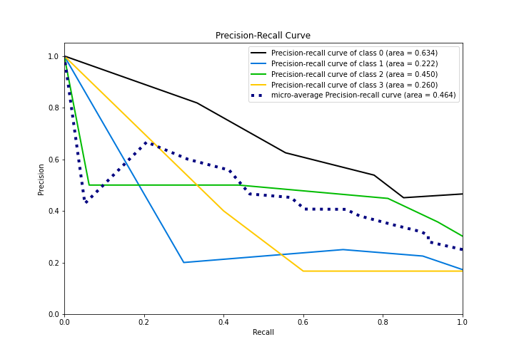

## SHAP Importance
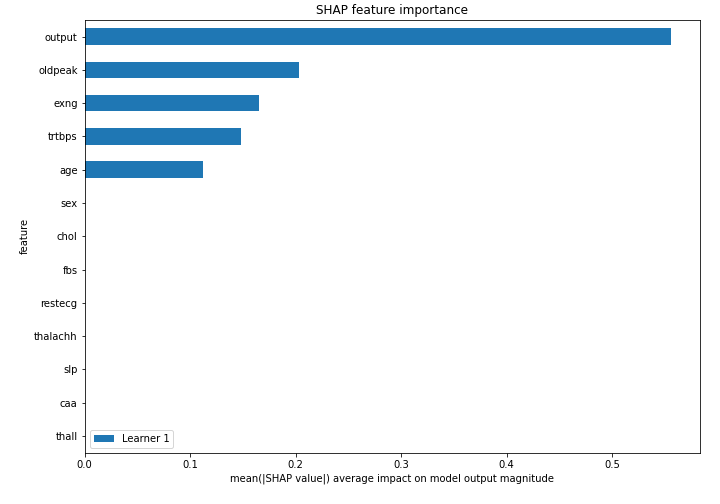

## SHAP Dependence plots

### Dependence 0 (Fold 1)
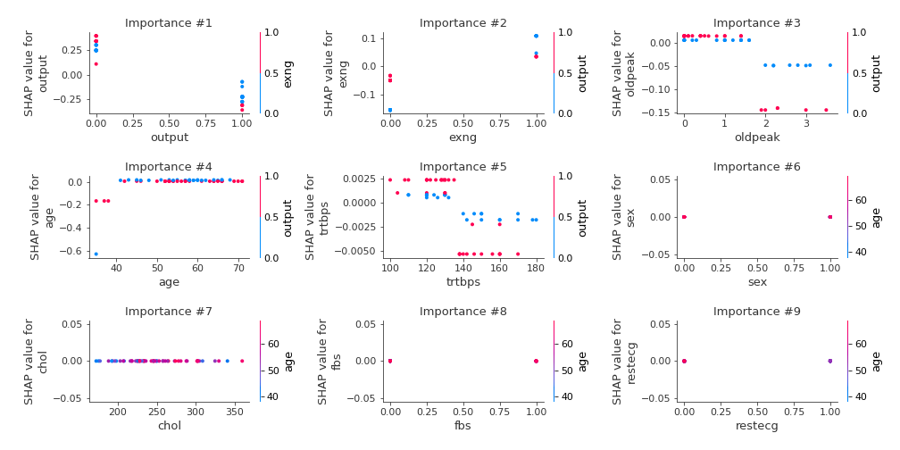
### Dependence 1 (Fold 1)
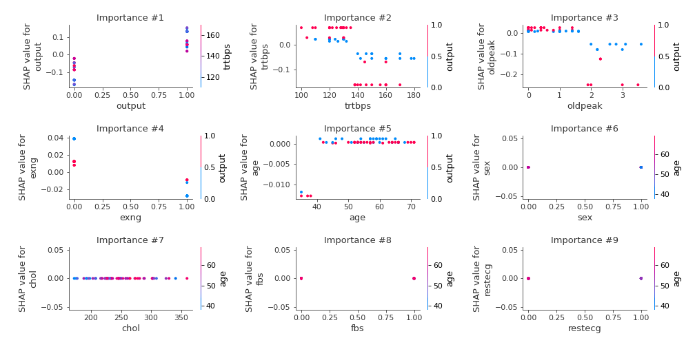
### Dependence 2 (Fold 1)
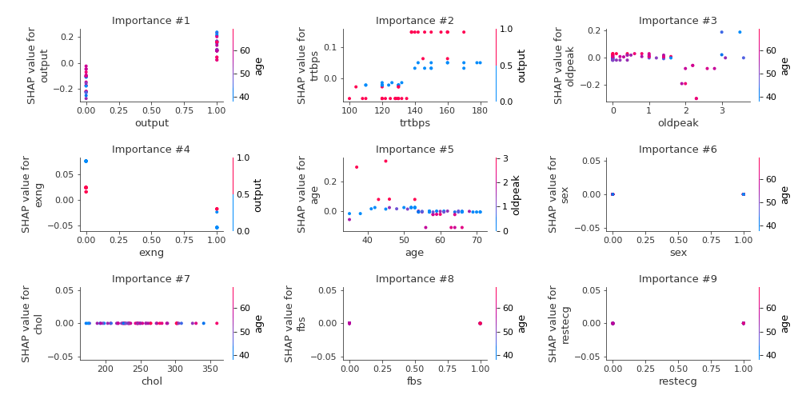
### Dependence 3 (Fold 1)
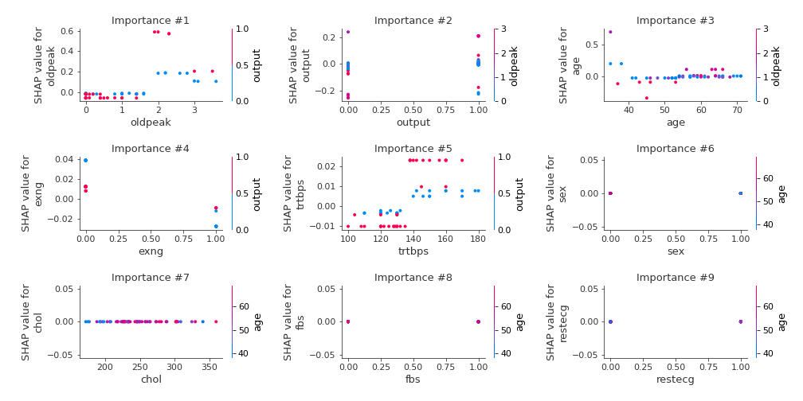

## SHAP Decision plots

### Worst decisions for selected sample 1 (Fold 1)
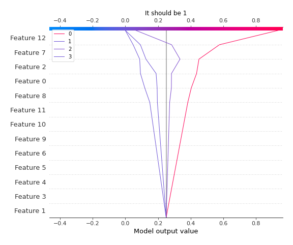
### Worst decisions for selected sample 2 (Fold 1)

### Worst decisions for selected sample 3 (Fold 1)

### Worst decisions for selected sample 4 (Fold 1)

### Best decisions for selected sample 1 (Fold 1)

### Best decisions for selected sample 2 (Fold 1)

### Best decisions for selected sample 3 (Fold 1)
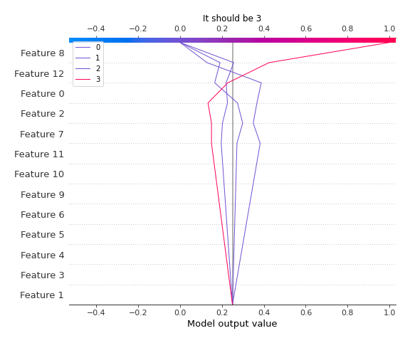
### Best decisions for selected sample 4 (Fold 1)
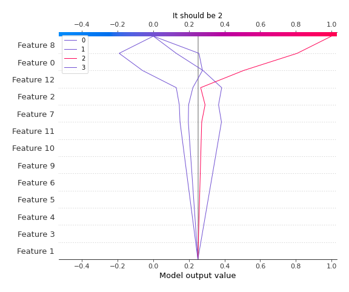

[<< Go back](../README.md)
