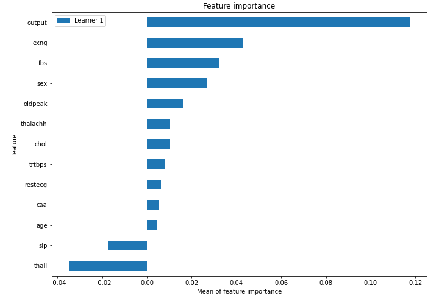
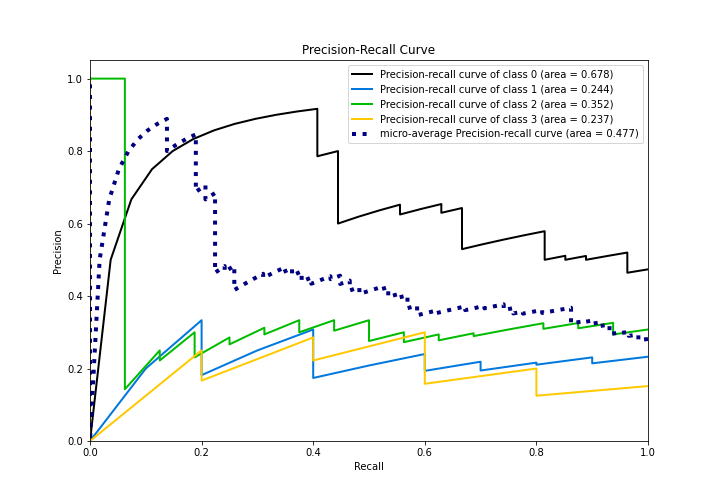

# Summary of 3_Linear

[<< Go back](../README.md)

## Logistic Regression (Linear)
- **n_jobs**: -1
- **num_class**: 4
- **explain_level**: 2

## Validation
 - **validation_type**: split
 - **train_ratio**: 0.75
 - **shuffle**: True
 - **stratify**: True

## Optimized metric
logloss

## Training time

10.8 seconds

### Metric details
|           |         0 |         1 |       2 |        3 |   accuracy |   macro avg |   weighted avg |   logloss |
|:----------|----------:|----------:|--------:|---------:|-----------:|------------:|---------------:|----------:|
| precision |  0.586207 |  0.222222 |  0.3125 | 0.25     |   0.431034 |    0.342732 |       0.418962 |   1.28991 |
| recall    |  0.62963  |  0.2      |  0.3125 | 0.2      |   0.431034 |    0.335532 |       0.431034 |   1.28991 |
| f1-score  |  0.607143 |  0.210526 |  0.3125 | 0.222222 |   0.431034 |    0.338098 |       0.424297 |   1.28991 |
| support   | 27        | 10        | 16      | 5        |   0.431034 |   58        |      58        |   1.28991 |

## Confusion matrix
|              |   Predicted as 0 |   Predicted as 1 |   Predicted as 2 |   Predicted as 3 |
|:-------------|-----------------:|-----------------:|-----------------:|-----------------:|
| Labeled as 0 |               17 |                2 |                6 |                2 |
| Labeled as 1 |                6 |                2 |                2 |                0 |
| Labeled as 2 |                5 |                5 |                5 |                1 |
| Labeled as 3 |                1 |                0 |                3 |                1 |

## Learning curves

## Coefficients

### Coefficients learner #1
|           |          0 |          1 |          2 |           3 |
|:----------|-----------:|-----------:|-----------:|------------:|
| intercept |  0.860581  | -0.579607  |  0.767143  | -1.04812    |
| age       |  0.0434697 | -0.0798967 | -0.072557  |  0.108984   |
| sex       | -0.0973908 | -0.0127814 | -0.0898749 |  0.200047   |
| trtbps    |  0.0196341 | -0.155463  | -0.0186437 |  0.154472   |
| chol      |  0.0235234 |  0.13626   | -0.0119894 | -0.147794   |
| fbs       | -0.454113  | -0.0352849 |  0.500038  | -0.0106401  |
| restecg   |  0.21158   |  0.0421701 | -0.0234819 | -0.230268   |
| thalachh  | -0.196739  |  0.102702  | -0.0624121 |  0.156449   |
| exng      |  0.742306  | -0.418459  | -0.728326  |  0.404479   |
| oldpeak   | -0.162807  | -0.847404  |  0.0209477 |  0.989264   |
| slp       | -0.179563  |  0.18041   | -0.0103354 |  0.00948795 |
| caa       |  0.280285  |  0.161209  | -0.0807667 | -0.360728   |
| thall     |  0.082437  | -0.429566  |  0.351975  | -0.00484564 |
| output    | -0.795297  |  0.268485  |  0.158747  |  0.368065   |

## Permutation-based Importance

## Confusion Matrix

## Normalized Confusion Matrix

## ROC Curve

## Precision Recall Curve

## SHAP Importance

## SHAP Dependence plots

### Dependence 0 (Fold 1)

### Dependence 1 (Fold 1)

### Dependence 2 (Fold 1)

### Dependence 3 (Fold 1)

## SHAP Decision plots

### Worst decisions for selected sample 1 (Fold 1)

### Worst decisions for selected sample 2 (Fold 1)

### Worst decisions for selected sample 3 (Fold 1)

### Worst decisions for selected sample 4 (Fold 1)

### Best decisions for selected sample 1 (Fold 1)

### Best decisions for selected sample 2 (Fold 1)

### Best decisions for selected sample 3 (Fold 1)

### Best decisions for selected sample 4 (Fold 1)

[<< Go back](../README.md)
