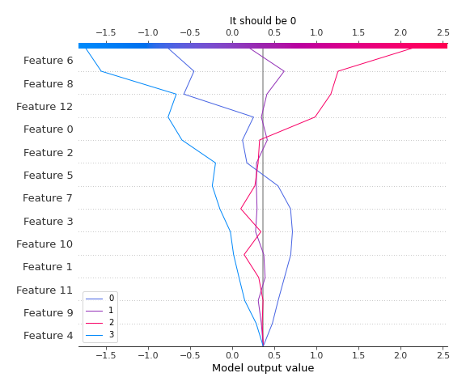

# Summary of 4_Default_Xgboost

[<< Go back](../README.md)

## Extreme Gradient Boosting (Xgboost)
- **n_jobs**: -1
- **objective**: multi:softprob
- **eta**: 0.075
- **max_depth**: 6
- **min_child_weight**: 1
- **subsample**: 1.0
- **colsample_bytree**: 1.0
- **eval_metric**: mlogloss
- **num_class**: 4
- **explain_level**: 2

## Validation
 - **validation_type**: split
 - **train_ratio**: 0.75
 - **shuffle**: True
 - **stratify**: True

## Optimized metric
logloss

## Training time

11.7 seconds

### Metric details
|           |         0 |         1 |         2 |        3 |   accuracy |   macro avg |   weighted avg |   logloss |
|:----------|----------:|----------:|----------:|---------:|-----------:|------------:|---------------:|----------:|
| precision |  0.8125   |  0.285714 |  0.423077 | 0.333333 |        0.5 |    0.463656 |       0.57294  |   1.17509 |
| recall    |  0.481481 |  0.2      |  0.6875   | 0.6      |        0.5 |    0.492245 |       0.5      |   1.17509 |
| f1-score  |  0.604651 |  0.235294 |  0.52381  | 0.428571 |        0.5 |    0.448082 |       0.503488 |   1.17509 |
| support   | 27        | 10        | 16        | 5        |        0.5 |   58        |      58        |   1.17509 |

## Confusion matrix
|              |   Predicted as 0 |   Predicted as 1 |   Predicted as 2 |   Predicted as 3 |
|:-------------|-----------------:|-----------------:|-----------------:|-----------------:|
| Labeled as 0 |               13 |                2 |               10 |                2 |
| Labeled as 1 |                2 |                2 |                4 |                2 |
| Labeled as 2 |                1 |                2 |               11 |                2 |
| Labeled as 3 |                0 |                1 |                1 |                3 |

## Learning curves

## Permutation-based Importance

## Confusion Matrix

## Normalized Confusion Matrix

## ROC Curve

## Precision Recall Curve

## SHAP Importance

## SHAP Dependence plots

### Dependence 0 (Fold 1)

### Dependence 1 (Fold 1)

### Dependence 2 (Fold 1)

### Dependence 3 (Fold 1)

## SHAP Decision plots

### Worst decisions for selected sample 1 (Fold 1)

### Worst decisions for selected sample 2 (Fold 1)

### Worst decisions for selected sample 3 (Fold 1)

### Worst decisions for selected sample 4 (Fold 1)

### Best decisions for selected sample 1 (Fold 1)

### Best decisions for selected sample 2 (Fold 1)

### Best decisions for selected sample 3 (Fold 1)

### Best decisions for selected sample 4 (Fold 1)

[<< Go back](../README.md)
