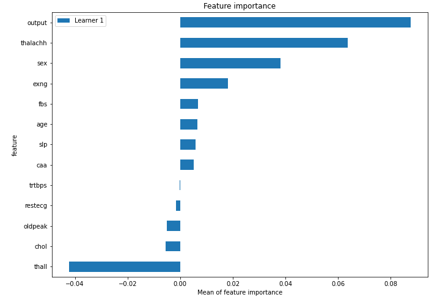
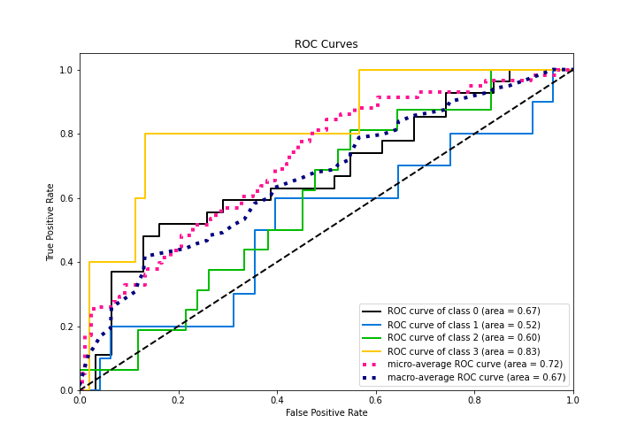

# Summary of 5_Default_NeuralNetwork

[<< Go back](../README.md)

## Neural Network
- **n_jobs**: -1
- **dense_1_size**: 32
- **dense_2_size**: 16
- **learning_rate**: 0.05
- **num_class**: 4
- **explain_level**: 2

## Validation
 - **validation_type**: split
 - **train_ratio**: 0.75
 - **shuffle**: True
 - **stratify**: True

## Optimized metric
logloss

## Training time

1.2 seconds

### Metric details
|           |         0 |         1 |         2 |        3 |   accuracy |   macro avg |   weighted avg |   logloss |
|:----------|----------:|----------:|----------:|---------:|-----------:|------------:|---------------:|----------:|
| precision |  0.64     |  0.222222 |  0.35     | 0.5      |   0.465517 |    0.428056 |       0.4759   |   1.31418 |
| recall    |  0.592593 |  0.2      |  0.4375   | 0.4      |   0.465517 |    0.407523 |       0.465517 |   1.31418 |
| f1-score  |  0.615385 |  0.210526 |  0.388889 | 0.444444 |   0.465517 |    0.414811 |       0.468364 |   1.31418 |
| support   | 27        | 10        | 16        | 5        |   0.465517 |   58        |      58        |   1.31418 |

## Confusion matrix
|              |   Predicted as 0 |   Predicted as 1 |   Predicted as 2 |   Predicted as 3 |
|:-------------|-----------------:|-----------------:|-----------------:|-----------------:|
| Labeled as 0 |               16 |                3 |                7 |                1 |
| Labeled as 1 |                4 |                2 |                4 |                0 |
| Labeled as 2 |                4 |                4 |                7 |                1 |
| Labeled as 3 |                1 |                0 |                2 |                2 |

## Learning curves

## Permutation-based Importance

## Confusion Matrix

## Normalized Confusion Matrix

## ROC Curve

## Precision Recall Curve

[<< Go back](../README.md)
