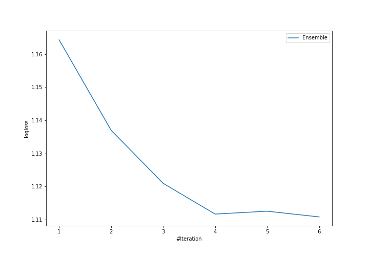
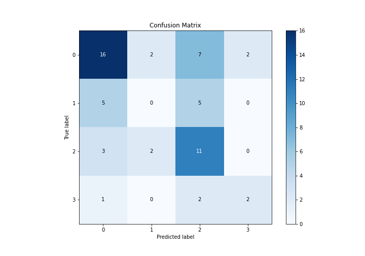
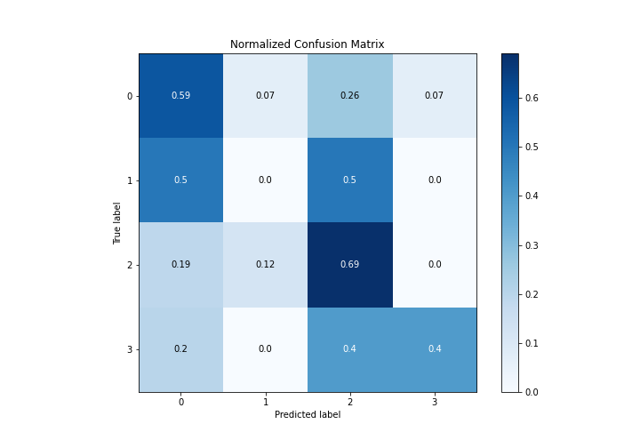
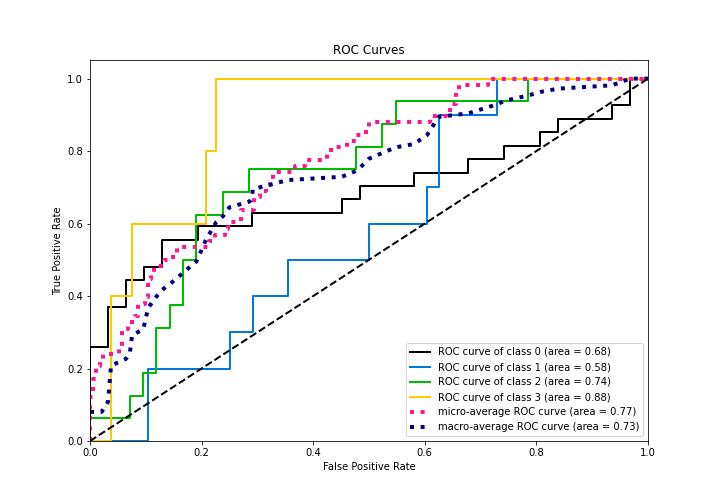
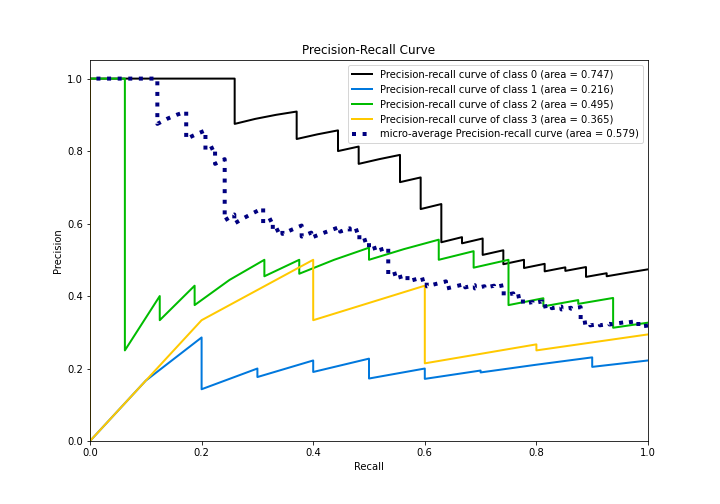

# Summary of Ensemble

[<< Go back](../README.md)

## Ensemble structure
| Model                  |   Weight |
|:-----------------------|---------:|
| 1_Baseline             |        2 |
| 2_DecisionTree         |        1 |
| 4_Default_Xgboost      |        2 |
| 6_Default_RandomForest |        1 |

### Metric details
|           |         0 |   1 |         2 |        3 |   accuracy |   macro avg |   weighted avg |   logloss |
|:----------|----------:|----:|----------:|---------:|-----------:|------------:|---------------:|----------:|
| precision |  0.64     |   0 |  0.44     | 0.5      |        0.5 |    0.395    |       0.462414 |   1.11079 |
| recall    |  0.592593 |   0 |  0.6875   | 0.4      |        0.5 |    0.420023 |       0.5      |   1.11079 |
| f1-score  |  0.615385 |   0 |  0.536585 | 0.444444 |        0.5 |    0.399104 |       0.47281  |   1.11079 |
| support   | 27        |  10 | 16        | 5        |        0.5 |   58        |      58        |   1.11079 |

## Confusion matrix
|              |   Predicted as 0 |   Predicted as 1 |   Predicted as 2 |   Predicted as 3 |
|:-------------|-----------------:|-----------------:|-----------------:|-----------------:|
| Labeled as 0 |               16 |                2 |                7 |                2 |
| Labeled as 1 |                5 |                0 |                5 |                0 |
| Labeled as 2 |                3 |                2 |               11 |                0 |
| Labeled as 3 |                1 |                0 |                2 |                2 |

## Learning curves

## Confusion Matrix

## Normalized Confusion Matrix

## ROC Curve

## Precision Recall Curve

[<< Go back](../README.md)
