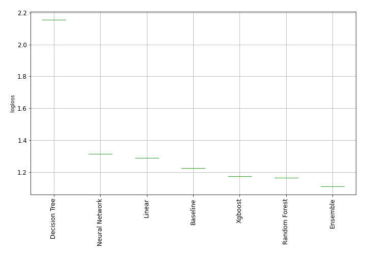

# AutoML Leaderboard

| Best model   | name                                                         | model_type     | metric_type   |   metric_value |   train_time |
|:-------------|:-------------------------------------------------------------|:---------------|:--------------|---------------:|-------------:|
|              | [1_Baseline](1_Baseline/README.md)                           | Baseline       | logloss       |        1.22601 |         2.4  |
|              | [2_DecisionTree](2_DecisionTree/README.md)                   | Decision Tree  | logloss       |        2.15369 |        12.48 |
|              | [3_Linear](3_Linear/README.md)                               | Linear         | logloss       |        1.28991 |        11.84 |
|              | [4_Default_Xgboost](4_Default_Xgboost/README.md)             | Xgboost        | logloss       |        1.17509 |        12.8  |
|              | [5_Default_NeuralNetwork](5_Default_NeuralNetwork/README.md) | Neural Network | logloss       |        1.31418 |         2.1  |
|              | [6_Default_RandomForest](6_Default_RandomForest/README.md)   | Random Forest  | logloss       |        1.1643  |        15.32 |
| **the best** | [Ensemble](Ensemble/README.md)                               | Ensemble       | logloss       |        1.11079 |         0.31 |

### AutoML Performance

### AutoML Performance Boxplot

### Features Importance

### Spearman Correlation of Models

